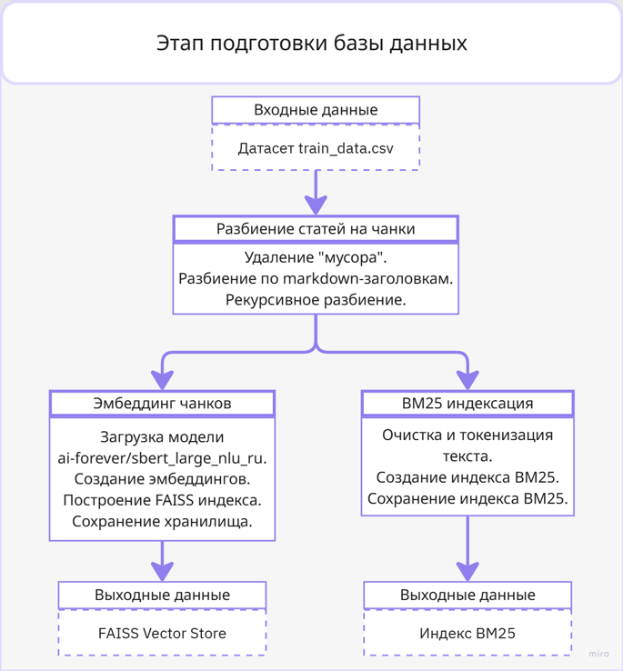
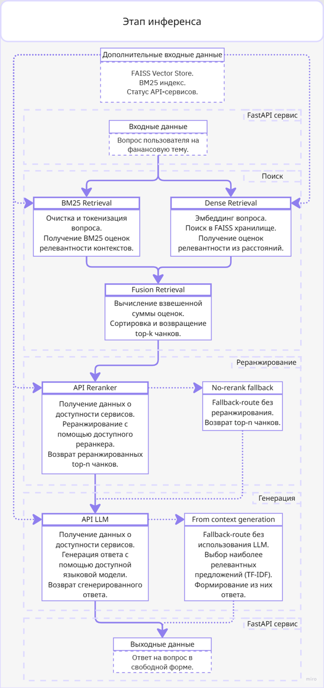

# Отчёт по итоговому проекту по курсу «Инженерия Искусственного Интеллекта»

---

## 1. Паспорт проекта

- **Название проекта:** `Разработка Финансового RAG-Ассистента`
- **Автор:** `Русу Ксения Олеговна`
- **Группа:** `БФБО-01-22`
- **Контакт:** `@Kayrell1002`
- **Ссылка на репозиторий:** `https://github.com/rusu1002/aie-dpo-mirea/`

   `Проект посвящён разработке RAG-системы для ответа на вопросы пользователей по финансовой документации. Система использует гибридный поиск, объединяющий плотный (Dense Retrieval на эмбеддингах) и разреженный (BM25) ретривинг, а также реранжирование найденных документов для повышения качества ответов. Используется датасет, предоставленный на одном из хакатонов, открытые модели эмбеддер, реранкер и LLM. Результат – REST API сервис, который принимает вопрос пользователя и возвращает ответ, сформированный на основе найденного контекста.`

---

## 2. Постановка задачи и контекст

1. **Предметная область и задача:**
   - Целью проекта является разработка сервиса на основе Retrieval-Augmented Generation (RAG), предназначенного для поиска релевантной информации во внутренней базе знаний и генерации ответов на вопросы пользователей;
   - Сервис функционирует как интеллектуальный банковский ассистент: пользователь задает вопросы о финансовых продуктах и услугах, а система находит релевантную информацию в базе знаний и формирует ответ с использованием языковой модели.

2. **Формулировка задачи в терминах ML/ИИ:**
   - Входные данные: корпус документов; запрос пользователя;
   - Целевая переменная — текстовый ответ, который должен быть семантически верным тексту множества релевантных чанков;
   - Основными ограничениями системы являются: требования к времени работы в процессе инференса, зависимость от внешних API-сервисов, ограничения контекстного окна LLM, затруднительная интерпретируемость выхода системы, необходимость обеспечения фактической достоверности ответа на основе документов базы знаний.

3. **Целевые метрики качества:**
   - Для оценки алгоритмов ретривинга (на этапе экспериментов) используются метрики информационного поиска:
	   - Hit@K — показывает, содержится ли хотя бы один релевантный документ среди первых K найденных документов;
	   - MRR (Mean Reciprocal Rank) — оценивает позицию первого релевантного документа в выдаче;
	   - nDCG@K (Normalized Discounted Cumulative Gain) — дисконтированный кумулятивный выигрыш; учитывает как наличие релевантных документов, так и качество их ранжирования.
   - Для оценки финальной системы используются метрики RAGAS (RAG Assessment):
	   - Average Contextual Relevancy (контекстная релевантность) — оценивает, насколько извлеченные чанки релевантны запросу; в отличие от Hit@K/MRR, вычисляется с помощью LLM-as-judge.
	   - Average Answer Relevancy (релевантность ответа) — измеряет, насколько сгенерированный ответ отвечает на запрос (по смыслу, без учета фактической точности).
	   - Average Faithfulness (верность фактам) — измеряет долю утверждений в ответе, которые могут быть подтверждены извлеченными чанками.

---

## 3. Данные

1. **Источник данных:**
   - открытые данные, предоставленные в рамках хакатона AI For Finance Hack 2025 ([ссылка на источник](https://changellenge.com/championships/aiforfinancehack/));

2. **Структура данных:**
   - `train_data.csv` — используется в качестве базы знаний для системы Retrieval-Augmented Generation; `questions.csv` — содержит набор пользовательских вопросов, используемых для тестирования и оценки качества работы системы.
   - `train_data.csv` — id, annotation, tags, text; `questions.csv` — ID вопроса, Вопрос.
   - В `train_data.csv` все признаки текстовые, в `questions.csv` ID вопроса целочисленный, а Вопрос текстовый.

3. **Предобработка и EDA:**
   - В ходе анализа были выполнены следующие этапы предобработки:
      - проверка структуры данных и типов признаков;
      - поиск пропущенных значений и дубликатов;
      - анализ распределения длин документов и вопросов;
      - исследование теговой разметки статей;
      - лексический анализ текстов и вопросов;
      - анализ markdown-разметки документов для последующего построения стратегии чанкинга.
   - В результате разведочного анализа были сделаны следующие выводы:
      - практически все статьи содержат структурированную markdown-разметку, которая может использоваться при чанкинге.
      - теги слабо связаны с лексическим содержимым статей и не подходят для организации поиска.

   Основные шаги EDA и подготовки данных лежат в ноутбуках `notebooks/01_EDA.ipynb` и `notebooks/02_baselines.ipynb`.

---

## 4. Модели и подходы

1. **Базовые (baseline) модели:**
   - TF-IDF Retrieval;
   - BM25 Retrieval;
   - Dense Retrieval на основе SBERT.

   - TF-IDF: 
      - Hit@1	0.356;
      - Hit@3	0.622;
      - Hit@5	0.722;
      - MRR@5	0.491;
      - nDCG@5 0.316;
   - BM25:
      - Hit@1	0.533;
      - Hit@3	0.756;
      - Hit@5	0.822;
      - MRR@5	0.641;
      - nDCG@5 0.375;
   - Dense Retrieval:
      - Hit@1	0.167;
      - Hit@3	0.422;
      - Hit@5	0.522;
      - MRR@5	0.307;
      - nDCG@5 0.172.

2. **Улучшенные модели и эксперименты:**
   - TF-IDF + Dense Hybrid;
   - BM25 + Dense Hybrid;
   - RRF TF-IDF + Dense Retrieval;
   - RRF BM25 + Dense Retrieval;
   - Weighted RRF TF-IDF + Dense Retrieval;
   - Weighted RRF BM25 + Dense Retrieval.

   - Добавление семантического поиска к лексическим ретриверам положительно влияет на качество поиска. Наиболее эффективными оказались методы, использующие линейную комбинацию нормализованных оценок лексического и семантического ретриверов;
   - Для оценки влияния параметров на качество поиска был выполнен перебор различных конфигураций гибридных методов. Для линейных гибридов TF-IDF + Dense и BM25 + Dense исследовались значения коэффициента α из множества: {0.1; 0.2; 0.3; 0.5; 0.7; 0.9}. Для методов на основе Reciprocal Rank Fusion исследовались различные значения параметра rrf_k: {30; 60; 100}. Для взвешенного RRF дополнительно варьировался коэффициент α, определяющий вклад лексического и семантического ретриверов.

   Все эксперименты были реализованы в ноутбуке `notebooks/02_baselines.ipynb`.

---

## 5. Экспериментальный протокол и результаты

1. **Экспериментальный протокол:**
   - Разделение данных на обучающую, валидационную и тестовую выборки не выполнялось. Все модели оценивались на одном и том же наборе запросов, что обеспечивало корректность сравнительного анализа;
   - Оценка качества ретриверов выполнялась на наборе из 90 подготовленных запросов по метрикам Hit@1, Hit@3, Hit@5, MRR@5 и nDCG@5. Для каждого запроса был заранее известен релевантный документ.

2. **Сравнение моделей по метрикам:**

   | Модель | Краткое описание | Hit@1 | Hit@3 | Hit@5 | MRR@5 | nDCG@5 | Комментарий |
   |--------|------------------|-------|-------|-------|-------|--------|-------------|
   | TF-IDF | Лексический поиск на основе TF-IDF | 0.356 | 0.622 | 0.722 | 0.491 | 0.316 | Baseline |
   | BM25 | Вероятностный лексический поиск | 0.533 | 0.756 | 0.822 | 0.641 | 0.375 | Baseline |
   | Dense Retrieval | Семантический поиск по эмбеддингам SBERT | 0.167 | 0.422 | 0.522 | 0.307 | 0.172 | Baseline |
   | TF-IDF + Dense Hybrid | Линейная комбинация TF-IDF и Dense | 0.500 | 0.700 | 0.789 | 0.597 | 0.346 | Experiment |
   | BM25 + Dense Hybrid | Линейная комбинация BM25 и Dense | 0.600 | 0.800 | 0.844 | 0.696 | 0.387 | Experiment |

3. **Выбор финальной модели:**
   - В качестве финальной модели ретривера была выбрана конфигурация BM25 + Dense Hybrid с коэффициентом α=0.5. Данная модель продемонстрировала лучшие значения по всем основным метрикам качества поиска: Hit@1 = 0.600, Hit@3 = 0.800, Hit@5 = 0.844, MRR@5 = 0.696 и nDCG@5 = 0.387 по сравнению с остальными архитектурами;
   - BM25 обеспечивает надежное нахождение документов с точным совпадением ключевых терминов, тогда как Dense Retrieval позволяет учитывать смысловую близость между запросом и документом; с точки зрения внедрения в сервис выбранная архитектура также является практичной. Для ее работы требуется хранение BM25-индекса и векторного индекса FAISS, которые были построены заранее и используются повторно во время выполнения запросов. Дополнительные вычисления при объединении оценок имеют линейную сложность и практически не влияют на время ответа системы. Благодаря этому достигается высокий уровень качества поиска без существенного увеличения вычислительных затрат.

---

## 6. Архитектура решения и сервис

Опишите, как из модели получился работающий сервис:

1. **Архитектура пайплайна:**
   - Документы чанкуются (фиксированный размер), для чанков строятся эмбеддинги (sbert_large_nlu_ru) и индекс BM25, сохраняемые в FAISS и для лексического поиска.
   - Запрос обрабатывается гибридным ретривом (FAISS + BM25) с линейной нормализацией оценок.
   - Кандидаты ранжируются через LangSearch/Cohere (при недоступности — пропуск этапа).
   - Отобранные контексты передаются в LLM (выбор из GPT-OSS-120B, Qwen3-Next-80B, GLM-4.5-Air с автоматическим переключением; при отказе — TF-IDF-ответ по контексту).
   - Доступ — REST API (FastAPI), возврат JSON.

   Схема этапа подготовки базы данных:
   
   Схема этапа инференса системы:
   

2. **API и endpoints:**
   
   - GET /health: Проверка работоспособности сервиса.
   - POST /predict: Основной эндпоинт для получения ответа RAG (принимает пользовательский запрос и возвращает сгенерированный ответ, а также источники).
   - GET /metrics: Метрики работы системы в формате Prometheus.
   - GET /docs: Автоматическая Swagger-документация FastAPI.

3. **Технологический стек:**
   - FastAPI; Streamlit; rank-bm25; NLTK; Hugging Face Transformers; FAISS; LangChain; scikit-learn;
   - Запуск сервиса:
```bash
cd project
uvicorn src.service.service:app --reload
```

---

## 7. Наблюдаемость, конфигурация и безопасность

1. **Логи и наблюдаемость:**
   В журнале событий фиксируются следующие категории информации:
      - запуск и завершение работы сервиса;
      - загрузка эмбеддера, векторного хранилища и BM25-индекса;
      - поступление пользовательских запросов;
      - начало и завершение этапов retrieval, reranking и generation;
      - количество найденных и отобранных документов;
      - время выполнения отдельных этапов и полного пайплайна;
      - обращения к внешним сервисам (LLM и реранкеры);
      - ошибки и предупреждения, возникающие при работе внешних API;
      - использование резервных механизмов при недоступности компонентов.


2. **Конфигурации:**
   - `.env.example`:
      - LLM_API_KEY — ваш ключ API для доступа к OpenRouter.
      - RERANKER_LANGSEARCH_API_KEY — ваш ключ API для доступа к Langsearch.
      - RERANKER_COHERE_API_KEY — ваш ключ API для доступа к Cohere.
   - `config.py`:
      Основные параметры конфигурации системы:
      - LLM_MODELS — список используемых языковых моделей.
      - EMBEDDER_MODEL — модель для построения эмбеддингов.
      - RERANKER_MODELS — список моделей реранжирования.
      - COHERE_JUDGE_MODEL — Cohere модель автоматической оценки качества ответов.
      - OPENROUTER_JUDGE_MODEL — OpenRouter модель автоматической оценки качества ответов.
      - TRAIN_DATA_PATH — путь к обучающему набору данных.
      - QUESTIONS_PATH — путь к файлу тестовых вопросов.
      - VECTORSTORE_PATH — путь к векторному индексу FAISS.
      - LOG_DIR — каталог журналов работы системы.
      - API_STATUS_FILE — файл состояния внешних сервисов.
      - EVAL_RESULTS_PATH — файл результатов оценки качества.
      - EVAL_REPORT_DIR — каталог отчетов DeepEval.
   - Без изменения программного кода могут быть перенастроены используемые языковые модели, модель эмбеддингов, модели LLM-as-Judge для оценки качества ответов.

3. **Безопасность:**
   - Для предотвращения случайной публикации секретов в репозитории настроен файл .gitignore, исключающий файлы окружения из отслеживания Git;
   - Журналы работы системы содержат информацию о состоянии сервиса, этапах выполнения RAG-пайплайна, времени обработки запросов и возникающих ошибках, однако не содержат API-ключей, паролей или других секретных данных.
   - Система не хранит пользовательские аккаунты и не обрабатывает персональные данные пользователей. В репозитории отсутствуют базы данных пользователей, персональные сведения, токены доступа и пароли.

---

## 8. Ограничения и дальнейшая работа

   - Основные ограничения:
      - сервис разворачивается локально и не контейнеризирован с помощью Docker;
      - не реализовано хранение истории запросов и ответов;
      - генерация выполняется через внешний LLM API, поэтому качество ответов зависит от доступности и характеристик выбранной модели;
      - эксперименты проведены преимущественно для ретривинг части, без детального сравнения различных генеративных моделей;

   - Проект может быть расширен в нескольких направлениях:
      - добавить Docker-контейнеризацию;
      - организовать хранение истории запросов и ответов в базе данных;
      - провести сравнительный анализ различных LLM-моделей для генерации ответов;
      - протестировать несколько реранкеров и оценить их влияние на качество поиска;
      - добавить автоматическую оценку качества ответов в пайплайн с использованием Retrieval Metrics и LLM-as-a-Judge;
      - реализовать автоматическое обновление индексов;
      - добавить веб-интерфейс для взаимодействия с системой;
      - расширить набор экспериментов и провести более детальное исследование влияния параметров чанкинга, эмбеддеров и методов гибридного поиска на качество ответов.

---

## 9. Сценарий демонстрации на защите

   На защите я:

   1. Кратко покажу структуру проекта (`notebooks/`, `src/`, `data/`).
   2. Запущу сервис через `uvicorn src.service.service:app --reload`, покажу отправку запроса и получение ответа.
   3. Покажу ноутбук с основными экспериментами и сравнение подходов к ретривингу по метрикам качества.

---
